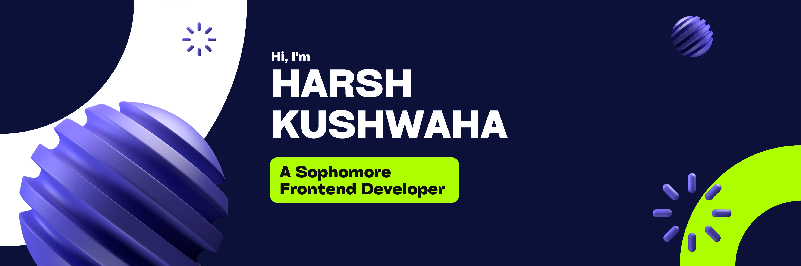

<!-- # ✨ **HARSH KUSHWAHA** ✨ -->

## 👨‍💻 Who Am I?

I'm a passionate technologist who thrives at the intersection of creativity and logic. My journey in the digital realm includes React.js development, exploring full-stack technologies, and diving into Linux systems. I approach every challenge with enthusiasm and a commitment to continuous improvement.

🌱 Currently learning React.js and exploring full-stack development

🔭 Building innovative projects that solve real-world problems

🎯 Outside of coding, I enjoy Photography, gaming, and exploring new tech trends

💡 Believer in clean code, elegant solutions, and lifelong learning

## 🛠️ Tech Arsenal

### Languages & Frameworks

### Styling & Design

### Backend & Database

### Tools & Environment

## 🏆 Milestones & Achievements

| 🚀 **Web App Developer** | 🏅 **Coding Event Organizer** |

## 🔥 Featured Projects

### [🔗 Bento Portfolio](https://bento.me/harsh-k)
A modern, minimalist portfolio showcasing my professional journey and technical expertise.
`#NextJS` `#TailwindCSS` `#ResponsiveDesign`

### [🧠 BarginBuddy](#)
A Price Comparing ChatBot currently under development.
`#ReactJS``#Liveblocks` `#AI`

## 📊 GitHub Stats

  <!-- GitHub Stats Card with Icons -->
  
  
  <!-- Top Languages as Donut Chart -->
  

<!-- Compact Contribution Calendar -->

##

  
   
  <em>Let's build something amazing together! Open to collaborations and interesting projects.</em>

<!-- 
README Design Credits:
- Inspired by various GitHub profiles
- GIFs from GIPHY
- Badges from shields.io
- Stats from github-readme-stats
-->
